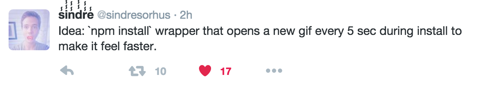
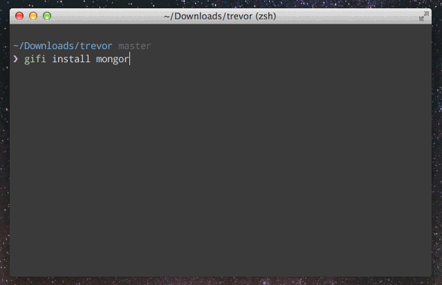

# gifi

<a href="https://twitter.com/sindresorhus/status/702220589419753472"></a>

So, it works exactly as advertised, watch GIFs right in your terminal while `npm install` is running.

**Note**: Currently, GIFs are only displayed inline for [users of iTerm2 using version 2.9 or greater](https://www.iterm2.com/images.html). If you are not using a supported version of iTerm2, GIFs will open in your default browser.

## Demo




## Installation

```
$ npm install gifi --global
```


## Usage

Replace `npm` with `gifi` and you're done:

```
$ gifi install koa --save
```

## Key to happiness

Alias `npm` to `gifi` and you're golden, `npm install` will never be boring again.
As a matter of fact, after using gifi you'll want `npm install` to be slower, because
you don't have enough time to watch all those great GIFs.

Add this to ~/.bashrc or ~/.zshrc:

```
alias npm=gifi
```


## License

MIT © [Vadim Demedes](https://github.com/vdemedes)
